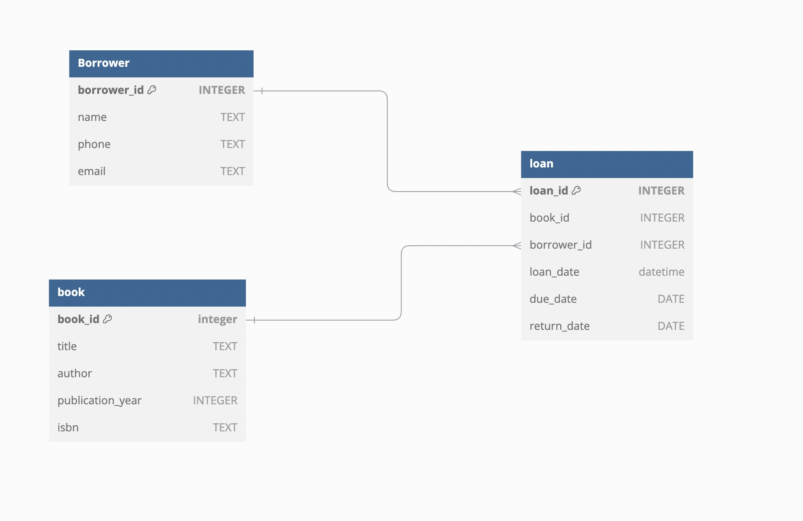

# Bibliotekssystem med SQLite

Detta projekt implementerar ett bibliotekssystem med en relationsdatabas i SQLite. Systemet hanterar böcker, låntagare och boklån. Detta README innehåller instruktioner för hur du skapar och kör systemet, samt hur du skapar och fyller databasen med exempeldata.

# Förutsättningar

Innan du börjar, se till att följande verktyg och programvara är installerade på din dator:

SQLite3:

Om du inte redan har SQLite installerat, ladda ner och installera det från SQLite. Kontrollera installationen genom att köra följande kommando i terminalen

```
sqlite3 --version
```

```
/library-system
  ├── commands.sql   # SQL-skriptet för att skapa och populera databasen
  └── library.db     # (Skapas automatiskt) SQLite-databasfilen
```

commands.sql: Innehåller SQL-koden för att skapa databasen, tabeller, infoga data och skapa vyer.

library.db: Skapas automatiskt när du kör projektet och fungerar som din databasfil.

```
sqlite3 library.db
```

Där commands.sql innehåller hela skriptet för att skapa och populera databasen (se nästa del).

## ER Diagram

Here is the Entity-Relationship Diagram for the database structure:


